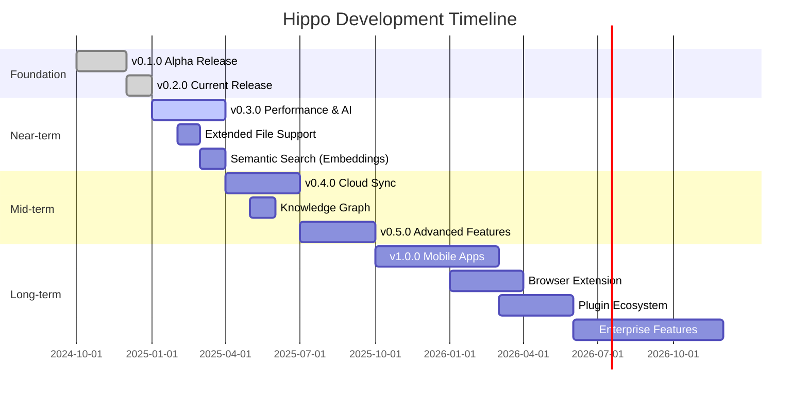

# Hippo Roadmap

> The Memory That Never Forgets - Product Development Timeline

## Version History

### v0.1.0-alpha (Initial Release)
**Released:** Q4 2024

**Core Features:**
- Basic file indexing for local folders
- SQLite-based storage layer
- Simple text search
- Tauri desktop application shell
- Support for common file types (images, documents, code)
- Grid and list view modes
- Basic metadata extraction

**Initial File Type Support:**
- Images: JPG, PNG, GIF, WebP, HEIC
- Documents: PDF, TXT, MD, DOCX
- Code: Rust, Python, JavaScript, Go
- Media: MP4, MOV, MP3, WAV

### v0.2.0 (Current Release)
**Released:** Q1 2025

**New Features:**
- Image and video thumbnail generation (256x256 cached)
- Advanced EXIF metadata extraction (camera, GPS, dimensions)
- Code AST parsing (imports, exports, functions)
- Tag management system with suggestions
- Real-time search with debouncing
- Client-side filtering by type and tags
- Multi-source management (add/remove/reindex)
- File watching (`hippo wade` command)
- Duplicate detection (`hippo twins` command)
- AI-powered tagging via Claude API (`hippo brain` command)
- Ollama integration for local LLM chat
- Knowledge export to markdown
- Detail panel with file operations
- Keyboard shortcuts (⌘K search, Esc close)
- Background indexing with progress tracking
- Parallel batch processing with rayon
- Cross-platform support (macOS, Linux, Windows)

**Enhanced CLI:**
- `hippo index` - Index local folders
- `hippo search` - Search indexed files
- `hippo wade` - Watch folders for changes
- `hippo twins` - Find duplicate files
- `hippo brain` - AI tagging and analysis
- `hippo chat` - Interactive AI assistant
- `hippo stats` - Show index statistics

## Current Features (Implemented)

### Core Functionality

#### Indexing
- Local folder indexing via native file picker
- Background async worker with progress updates
- 70+ supported file extensions
- Parallel batch processing for performance
- Smart file discovery with ignore patterns
- Automatic re-indexing on file changes (watch mode)
- Incremental indexing (only changed files)

#### Search & Discovery
- Full-text search across filenames, paths, and tags
- Real-time search with 300ms debouncing
- Tag-based filtering (include/exclude)
- Type filtering (Images, Videos, Audio, Code, Documents)
- Multiple sort options (date, name, size)
- Search suggestions from existing tags
- Tab key to convert search text to tag filter

#### Storage
- SQLite database with JSON columns for flexibility
- Efficient indexing with prepared statements
- Tag counting and management
- Source configuration persistence
- Smart cache invalidation for thumbnails
- Database location: `~/Library/Application Support/Hippo/hippo.db`

#### Metadata Extraction
- EXIF data for images (camera model, GPS coordinates, dimensions)
- Code parsing for multiple languages (imports, exports, functions)
- Document metadata (page count, format)
- Media duration and format detection
- File size, dates, and MIME type detection
- Hash-based duplicate detection (SHA-256)

### AI Features

#### Ollama Integration
- Local LLM support (Llama 3.2, Mistral, etc.)
- Streaming chat interface with context
- Code explanation and documentation generation
- Knowledge synthesis from indexed files
- Privacy-focused (runs entirely local)

#### Claude API Integration
- Intelligent auto-tagging based on file content
- Batch tagging for large file sets
- Smart tag suggestions
- Natural language file analysis

#### Chat & Analysis
- Interactive AI assistant for file exploration
- Context-aware responses using indexed metadata
- Code review and explanation
- Document summarization
- Image content description

### User Interface

#### Desktop Application (Tauri)
- Cross-platform native app (macOS, Linux, Windows)
- Modern, responsive design
- Grid and list view modes
- Type filter pills with counts
- Tag management UI
- Detail panel with file preview
- Keyboard shortcuts (⌘K, Esc)
- Native file operations (open, reveal in Finder/Explorer)
- Progress indicators for long-running operations

#### Visual Features
- Image thumbnails (256x256 JPEG, cached)
- Video thumbnails (frame extraction via ffmpeg)
- Async loading with placeholders
- File type icons for all supported formats
- Tag badges with color coding
- Empty state illustrations
- Loading skeletons

#### Source Management
- Add folders via native dialog
- Remove sources with optional memory deletion
- Re-index individual sources
- Reset entire index
- Real-time indexing progress
- Auto-refresh during indexing

### Command-Line Interface

#### Core Commands
- `hippo index <path>` - Index a local folder
- `hippo search <query>` - Search indexed files
- `hippo stats` - Show index statistics
- `hippo sources` - List configured sources

#### Advanced Commands
- `hippo wade <path>` - Watch folder for changes
- `hippo twins [path]` - Find duplicate files
- `hippo brain <path>` - AI tagging and analysis
- `hippo chat` - Interactive AI assistant
- `hippo export` - Export knowledge to markdown

### Developer Features
- Comprehensive error handling with `thiserror`
- Structured logging with `tracing`
- Async runtime with Tokio
- Thread-safe design with Arc/Mutex
- Plugin-ready architecture
- Well-documented public API

## Near-term Roadmap (v0.3.0)

**Target Release:** Q2 2025

### Performance Optimizations
- [ ] Implement database connection pooling
- [ ] Add full-text search index (FTS5)
- [ ] Optimize thumbnail generation pipeline
- [ ] Implement lazy loading for large result sets
- [ ] Add result pagination for search
- [ ] Cache frequently accessed metadata
- [ ] Reduce memory footprint for large indexes
- [ ] Optimize parallel indexing batches

### Extended File Type Support
- [ ] PDF thumbnails and text extraction
- [ ] Audio waveform generation
- [ ] Spreadsheet preview (Excel, CSV, Numbers)
- [ ] Presentation preview (PowerPoint, Keynote)
- [ ] Archive inspection (ZIP, TAR, 7Z contents)
- [ ] 3D model support (OBJ, STL, GLTF)
- [ ] CAD file metadata (DWG, DXF)
- [ ] E-book formats (EPUB, MOBI)

### Enhanced AI Features
- [ ] Semantic search with embeddings (ONNX models)
  - CLIP for images
  - BGE for text
  - CodeBERT for code
- [ ] Vector database integration (Qdrant)
- [ ] Similarity search ("find similar files")
- [ ] Face detection and clustering
- [ ] Smart collections (auto-grouping by content)
- [ ] Natural language queries ("photos from last summer")
- [ ] Content-based recommendations

### UI/UX Improvements
- [ ] Dark mode with theme toggle
- [ ] Favorites/starred files
- [ ] Bulk operations (multi-select, bulk tagging)
- [ ] Drag-and-drop file addition
- [ ] Custom tag colors and icons
- [ ] Advanced filters panel (date ranges, size ranges)
- [ ] Saved searches
- [ ] Timeline view (files by date)
- [ ] Map view (files with GPS coordinates)

### Developer Experience
- [ ] Plugin system for custom extractors
- [ ] REST API for third-party integration
- [ ] Export/import index data (backup/restore)
- [ ] Configuration file support (TOML/YAML)
- [ ] Verbose logging modes for debugging
- [ ] Performance profiling tools
- [ ] Migration system for database schema changes

## Mid-term Roadmap (v0.4.0 - v0.5.0)

**Target Release:** Q3-Q4 2025

### Cloud Sync (Optional, E2E Encrypted)
- [ ] End-to-end encryption for cloud storage
- [ ] Conflict resolution for multi-device sync
- [ ] Selective sync (choose what to sync)
- [ ] Cloud storage providers:
  - [ ] Google Drive integration
  - [ ] iCloud Drive support
  - [ ] Dropbox connector
  - [ ] OneDrive integration
  - [ ] Amazon S3 support
  - [ ] Custom WebDAV support
- [ ] Encryption key management
- [ ] Local-first architecture (works offline)

### Knowledge Graph
- [ ] Visual knowledge graph (D3.js)
- [ ] Automatic relationship detection
- [ ] File similarity connections
- [ ] Temporal connections (files from same time)
- [ ] Spatial connections (files from same location)
- [ ] Semantic connections (related content)
- [ ] Interactive graph exploration
- [ ] Graph-based discovery ("explore related files")
- [ ] Export graph to various formats (GraphML, JSON)

### Enhanced Collaboration
- [ ] Shared collections (local network)
- [ ] Annotation system (notes on files)
- [ ] Version history tracking
- [ ] Collaborative tagging
- [ ] Activity feed (changes, additions)

### Advanced Search
- [ ] Boolean operators (AND, OR, NOT)
- [ ] Regex pattern matching
- [ ] Fuzzy search with typo tolerance
- [ ] Search within file contents (OCR for images)
- [ ] Search by visual similarity
- [ ] Search by color palette
- [ ] Geospatial queries ("within 10km of...")
- [ ] Date math queries ("last 30 days")

## Long-term Vision (v1.0+)

**Target Release:** 2026+

### Mobile Applications
- [ ] iOS app (Swift, native UI)
  - Native photo library integration
  - Camera roll sync
  - Share extension for quick saves
  - Offline mode with sync
- [ ] Android app (Kotlin, native UI)
  - Storage access framework integration
  - Quick capture shortcuts
  - Share menu integration
  - Background sync
- [ ] React Native fallback for rapid prototyping
- [ ] Mobile-optimized UI/UX
- [ ] Touch gestures for navigation

### Browser Extension
- [ ] Chrome/Edge extension
- [ ] Firefox add-on
- [ ] Safari Web Extension
- [ ] Features:
  - Save web pages to Hippo
  - Screenshot capture with auto-tagging
  - Right-click "Save to Hippo"
  - Quick search from browser toolbar
  - Sync browsing history (optional)

### Plugin Ecosystem
- [ ] Plugin API specification
- [ ] Official plugin SDK
- [ ] Plugin marketplace/registry
- [ ] Community plugin examples:
  - Custom metadata extractors
  - Cloud storage connectors
  - AI model integrations
  - Export format converters
  - Custom visualizations
- [ ] Plugin sandboxing for security
- [ ] Hot-reloading for development

### Enterprise Features
- [ ] Team workspaces
- [ ] Role-based access control (RBAC)
- [ ] Audit logging
- [ ] LDAP/SSO integration
- [ ] On-premise deployment
- [ ] High availability clustering
- [ ] Compliance features (GDPR, HIPAA)
- [ ] Advanced reporting and analytics

### AI Evolution
- [ ] On-device ML models (Core ML, TensorFlow Lite)
- [ ] Custom model training (transfer learning)
- [ ] Multi-modal search (text + image + audio)
- [ ] Automatic smart albums
- [ ] Predictive organization suggestions
- [ ] Content moderation (NSFW detection)
- [ ] Privacy-preserving federated learning

### Platform Expansion
- [ ] Web application (self-hosted)
- [ ] Docker container for easy deployment
- [ ] NAS integration (Synology, QNAP)
- [ ] HomeKit/Home Assistant integration
- [ ] IFTTT/Zapier connectors
- [ ] API webhooks for automation

## Development Timeline



## How to Contribute

We welcome contributions from the community! Here's how you can help:

### For Developers

#### High-Priority Items (v0.3.0)
1. **Full-Text Search (FTS5)**
   - File: `/hippo-core/src/storage/mod.rs`
   - Add SQLite FTS5 virtual table for fast text search
   - Migrate existing search to use FTS5 index

2. **PDF Thumbnail Generation**
   - File: `/hippo-core/src/thumbnails/mod.rs`
   - Use `pdfium-render` or `pdf-render` crate
   - Generate preview images for PDF documents

3. **Semantic Search with ONNX**
   - File: `/hippo-core/src/embeddings/mod.rs`
   - Implement CLIP model for image embeddings
   - Implement BGE model for text embeddings
   - Add Qdrant vector database integration

4. **Dark Mode**
   - File: `/hippo-tauri/ui/dist/index.html`
   - Add theme toggle button
   - Implement CSS variables for colors
   - Persist theme preference

#### Medium-Priority Items
5. **Audio Waveform Visualization**
   - File: `/hippo-core/src/thumbnails/mod.rs`
   - Use `waveform` or `dasp` crate
   - Generate waveform images for audio files

6. **Favorites System**
   - Files: `/hippo-core/src/models.rs`, `/hippo-core/src/storage/mod.rs`
   - Add `is_favorite` boolean to Memory
   - Add favorite filter to search UI
   - Add star/unstar command

7. **Bulk Operations**
   - File: `/hippo-tauri/ui/dist/index.html`
   - Implement multi-select with checkboxes
   - Add bulk tag/delete/move operations
   - Add "select all" and "clear selection"

8. **Plugin System**
   - Create new `/hippo-plugins/` directory
   - Design plugin API traits
   - Implement plugin discovery and loading
   - Create example plugins

### For Designers

9. **Custom Icons**
   - Replace placeholder icons with custom designs
   - Create consistent icon set for all file types
   - Design app logo and branding

10. **UI/UX Improvements**
    - Design advanced filters panel
    - Create timeline view mockups
    - Design map view for GPS-tagged files
    - Improve empty states and loading animations

### For Technical Writers

11. **Documentation**
    - Write user guide for common workflows
    - Create API documentation
    - Write plugin development tutorial
    - Translate docs to other languages

12. **Tutorials**
    - "Getting Started with Hippo"
    - "Advanced Search Techniques"
    - "Organizing Files with Tags"
    - "Using AI Features"

### For Testers

13. **Platform Testing**
    - Test on Windows (especially file paths)
    - Test on Linux distributions
    - Test with large file collections (100k+ files)
    - Test with various file encodings

14. **Bug Reports**
    - Open detailed issues with reproduction steps
    - Test edge cases (corrupted files, symlinks, etc.)
    - Performance testing and profiling

### For Community

15. **Feature Requests**
    - Share your use cases and workflows
    - Suggest new file type support
    - Propose AI/ML features
    - Vote on existing issues

16. **Evangelism**
    - Write blog posts about Hippo
    - Create video tutorials
    - Share on social media
    - Present at conferences/meetups

## Getting Started with Development

```bash
# Clone the repository
git clone https://github.com/yourusername/hippo.git
cd hippo

# Install Rust (if not already installed)
curl --proto '=https' --tlsv1.2 -sSf https://sh.rustup.rs | sh

# Build the core library
cd hippo-core
cargo build --release

# Run tests
cargo test

# Run the desktop app
cd ../hippo-tauri
cargo run

# Run the CLI
cd ../hippo-cli
cargo install --path .
hippo --help
```

## Contributing Guidelines

1. **Fork and Branch**
   - Fork the repository
   - Create a feature branch (`git checkout -b feature/amazing-feature`)

2. **Code Quality**
   - Run `cargo fmt` before committing
   - Run `cargo clippy` and fix warnings
   - Add tests for new features
   - Update documentation

3. **Commit Messages**
   - Use conventional commits format
   - Examples: `feat: add PDF thumbnails`, `fix: handle symlinks`, `docs: update roadmap`

4. **Pull Requests**
   - Link to related issues
   - Describe what changed and why
   - Include screenshots for UI changes
   - Ensure CI passes

5. **Code Review**
   - Be respectful and constructive
   - Ask questions if unclear
   - Suggest improvements, don't demand
   - Approve when ready

## Community & Support

- **GitHub Issues:** Bug reports and feature requests
- **GitHub Discussions:** Questions and community chat
- **Discord:** Real-time chat and support (coming soon)
- **Twitter:** Follow [@HippoApp](https://twitter.com/HippoApp) for updates

## License

Hippo is open-source software licensed under the MIT License. See `LICENSE` file for details.

---

**Note:** This roadmap is subject to change based on community feedback, technical constraints, and evolving priorities. Dates are estimates and may shift as development progresses.

Last updated: December 21, 2025
